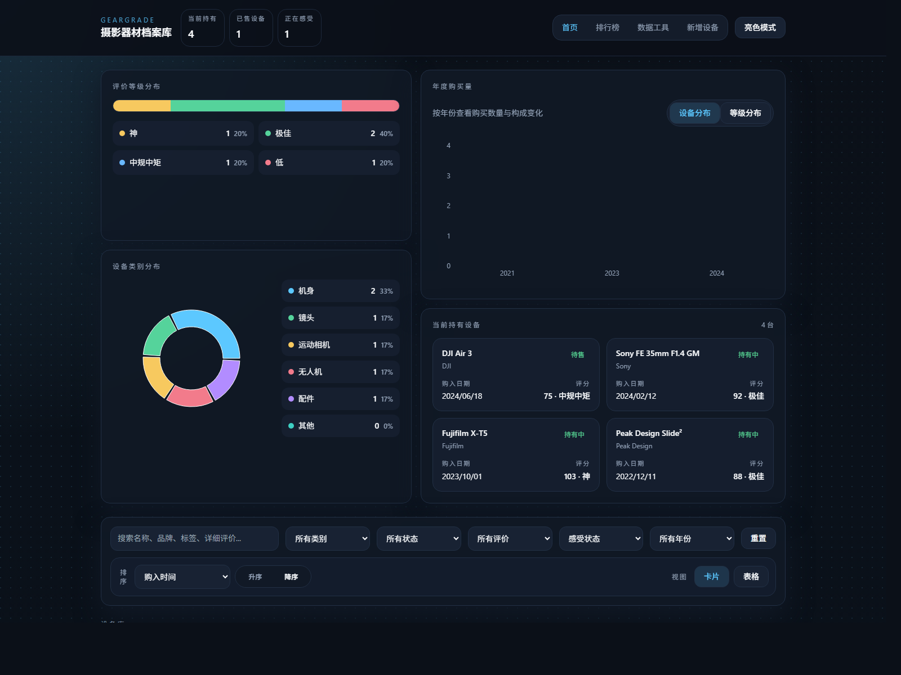
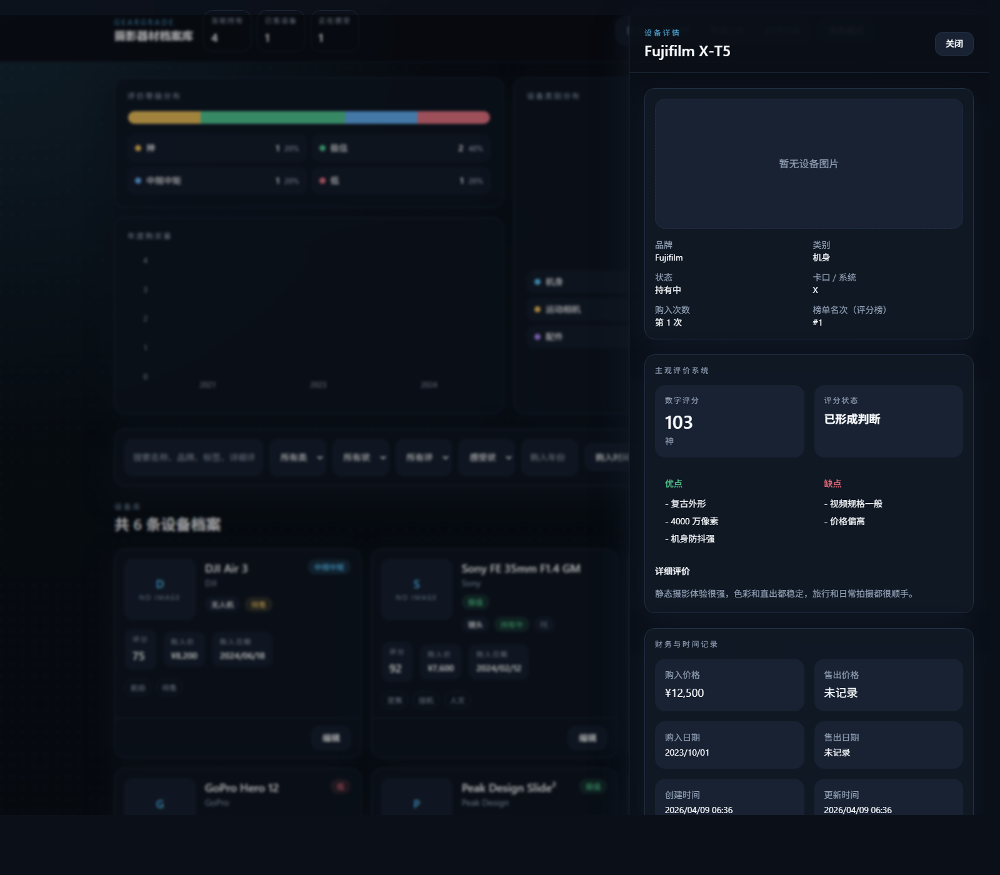
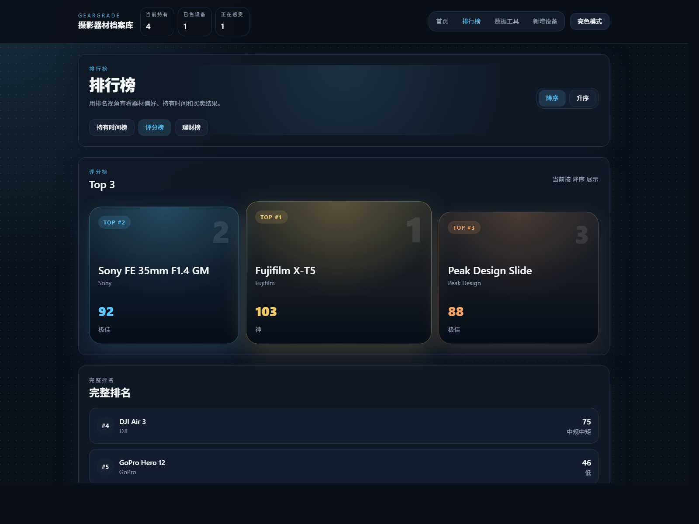
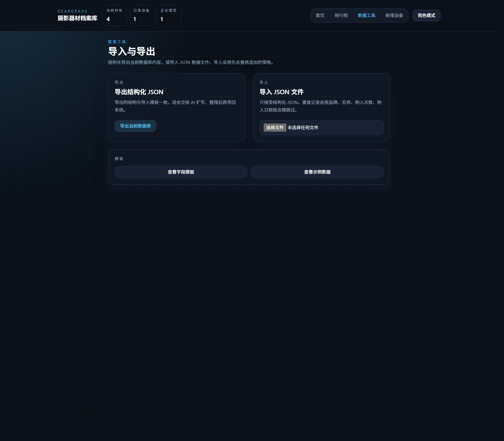
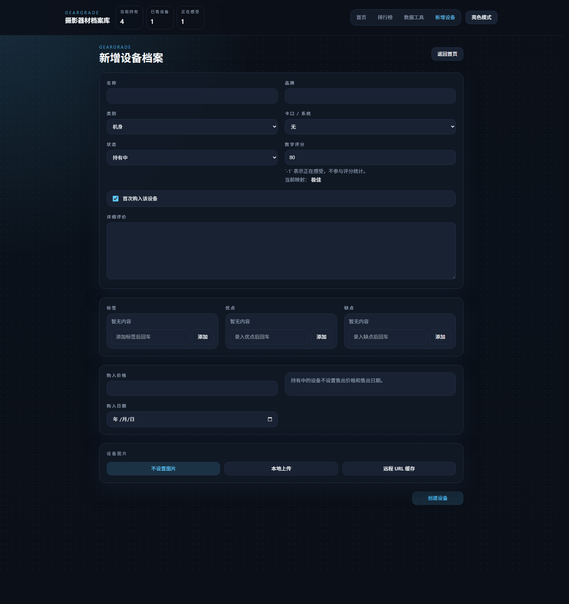

# Geargrade

Geargrade 是一个面向个人摄影器材管理的自托管 Web 应用。它的重点不是通用库存，而是“设备档案 + 持有状态 + 主观评价 + 买卖记录 + 浏览筛选 + 榜单分析”。

当前版本已经支持主设备库、独立心愿池、数据导入导出、全量重置、本地与远程图片录入，以及围绕评分、持有时长和理财结果的可视化展示。

## 累计更新（v0.4）

本次 v0.4 主要是对移动端布局、抽屉路由体验和交互动效稳定性做收口，重点变化如下：

- 顶部导航与摘要卡片重新压缩布局，小屏下信息密度更高，切换主题和主导航更顺手
- Dashboard 移动端重排为单列优先，年度图表、分布卡片和 teaser 面板减少挤压与溢出
- 当前持有设备改为稳定的覆盖层路由，支持从概览抽屉继续打开设备详情并逐层返回
- 详情抽屉挂载/卸载时机重做，修复关闭动画被打断、直接访问覆盖层路由异常等问题
- 页面滚动锁改为引用计数，避免多层抽屉叠加时 body 滚动状态错乱
- Release 离线镜像包、Compose 默认标签和文档示例同步升级到 `v0.4`

## 技术栈

- 前端：React + TypeScript + Vite + Tailwind CSS
- 后端：FastAPI + SQLAlchemy
- 数据库：SQLite
- 部署：Docker Compose
- 运行形态：单容器 `app`，内含后端 API 与前端静态资源

## 当前能力

- 主设备库 CRUD
- 独立心愿池 CRUD
- 深色 / 亮色主题切换
- 顶栏全局统计：当前持有、已售设备、正在感受
- Dashboard 可视化概览
- 评价等级分布
- 设备类别分布
- 年度购买量统计与分布叠加
- 当前持有设备快捷面板
- 卡片视图 / 表格视图切换
- 表格表头排序
- 关键词、类别、状态、评价、感受状态、购入年份筛选
- 设备详情右侧抽屉
- 数字评分映射评价体系
- `score = -1` 表示“正在感受”
- 第几次购入的角标展示
- 排行榜：评分榜、持有时间榜、理财榜
- 结构化 JSON 导入 / 导出
- 数据模板下载
- 五步确认的“重置所有数据”
- 本地图片上传
- 本地图片粘贴上传
- 远程图片 URL 下载缓存
- 示例数据自动初始化

## 页面截图

以下截图通过本地无头浏览器静默生成，文件位于 `docs/screenshots/`。

### 首页总览

首页展示顶栏统计、评分与类别图表、年度购买量、筛选区和主设备库列表。



### 设备详情抽屉

详情抽屉用于在不离开列表页的前提下查看完整设备档案，包括数字评分主视觉、优缺点、价格、持有时长与每日成本。



### 排行榜

排行榜页支持评分榜、持有时间榜和理财榜切换，顶部突出展示 Top 3，下面承接完整列表。



### 数据工具

数据工具已经并入“新增设备”页底部，用于导入主设备库 JSON、导出当前主设备库，以及执行高危数据重置。



### 新增设备

新增设备页支持录入品牌、类别、卡口系统、数字评分、购入次序、详细评价、价格与图片来源。



## 快速开始

1. 复制环境变量文件

```powershell
Copy-Item .env.example .env
```

2. 启动服务

```bash
docker compose up -d --build
```

3. 打开应用

```text
http://localhost:8080
```

## Docker Compose 模板

下面这个模板适合放在独立部署目录中，例如：

```text
deploy/
├─ docker-compose.yml
└─ .env
```

如果你使用 Release 里的离线镜像包，先导入镜像：

```bash
docker load -i geargrade-v0.4-linux-amd64.tar
```

ARM 设备改为：

```bash
docker load -i geargrade-v0.4-linux-arm64.tar
```

然后使用以下 Compose 模板：

```yaml
services:
  geargrade:
    image: geargrade:v0.4-amd64
    container_name: geargrade-app
    restart: unless-stopped
    ports:
      - "8080:8000"
    env_file:
      - .env
    volumes:
      - geargrade_data:/app/data
      - geargrade_media:/app/data/media

volumes:
  geargrade_data:
  geargrade_media:
```

ARM 镜像标签改为 `geargrade:v0.4-arm64`。

## 环境变量

`.env.example` 提供了默认配置：

- `APP_ENV`：运行环境标记
- `DATABASE_URL`：SQLite 数据库路径
- `MEDIA_ROOT`：图片缓存根目录
- `MEDIA_URL_PREFIX`：媒体公开路径前缀
- `SEED_SAMPLE_DATA`：首次启动且数据库为空时自动注入示例数据

## 数据与持久化

当前 Docker Compose 使用单个应用容器和两个命名卷：

- `geargrade-app`：唯一运行容器，同时提供 FastAPI API 与前端静态资源
- `geargrade_data`：SQLite 数据文件
- `geargrade_media`：上传图片和远程缓存图片

## 核心规则

### 评分规则

- `score = -1`：正在感受，不参与评分分布和评分榜
- `score = 0-49`：低
- `score = 50-79`：中规中矩
- `score = 80-100`：极佳
- `score > 100`：神

### 状态归一化

- `holding`：自动清空 `sale_price` 和 `sale_date`
- `for_sale`：自动清空 `sale_price` 和 `sale_date`
- `broken`：`sale_price` 自动记为 `0`，`sale_date` 为空
- `sold`：允许填写 `sale_price` 和 `sale_date`

### 每日成本规则

每日成本只在以下两种情况下计算：

- 持有中：`purchase_price / 持有天数`
- 已售出：`(purchase_price - sale_price) / 持有天数`

补充规则：

- 持有天数起点固定为 `purchase_date`
- 持有中终点取当前日期
- 已售出终点取 `sale_date`
- 天数最小按 `1` 天处理
- `for_sale` 和 `broken` 不计算每日成本

## 主设备库与心愿池

心愿池采用与主设备库“同结构、独立数据表”的方案。

这意味着：

- 心愿池不会进入首页 Dashboard 统计
- 心愿池不会进入主设备库列表与详情路由
- 心愿池不会进入评分榜、持有时间榜或理财榜
- 心愿池不会被主设备库的导入导出接口处理

当前导航结构：

- `/`：主设备库 Dashboard
- `/leaderboards`：排行榜
- `/wishlist`：心愿池
- `/devices/new`：新增主设备，同时在页底包含数据工具

## API 概览

### 主设备库

- `GET /api/v1/health`
- `GET /api/v1/dashboard/summary`
- `GET /api/v1/devices`
- `GET /api/v1/devices/{id}`
- `POST /api/v1/devices`
- `PATCH /api/v1/devices/{id}`
- `DELETE /api/v1/devices/{id}`

### 排行榜

- `GET /api/v1/leaderboards/holding-duration`
- `GET /api/v1/leaderboards/score`
- `GET /api/v1/leaderboards/finance`

### 心愿池

- `GET /api/v1/wishlist/devices`
- `GET /api/v1/wishlist/devices/{id}`
- `POST /api/v1/wishlist/devices`
- `PATCH /api/v1/wishlist/devices/{id}`
- `DELETE /api/v1/wishlist/devices/{id}`

### 数据工具

- `GET /api/v1/data/export`
- `POST /api/v1/data/import`
- `POST /api/v1/data/reset`

### 媒体

- `POST /api/v1/media/upload`
- `POST /api/v1/media/cache-remote`

### 引导

- `POST /api/v1/bootstrap/sample-data`

## 导入导出

导入导出当前只针对主设备库，不包含心愿池。

导入行为：

- 格式：结构化 JSON
- 策略：先去重，再追加
- 去重键：`brand + name + acquisition_iteration + purchase_date`
- 重复项：跳过，不覆盖更新

模板文件：

- `templates/device-import.template.json`
- `templates/device-import.example.json`

导出结果可以直接再导入，也适合“导出 -> 让 AI 整理或补全 -> 再导回”的工作流。

## 数据重置

“重置所有数据”入口位于“新增设备”页底部的数据工具区。

执行规则：

- 前端需要连续确认 5 次
- 任意取消或关闭都会将确认进度清零
- 后端会一次性清空：
  - 主设备库
  - 心愿池
  - 本地媒体文件

接口返回结果包括：

- `devices_deleted`
- `wishlist_deleted`
- `media_files_deleted`

## 本地开发

### 后端

```bash
cd backend
python -m venv .venv
.venv\Scripts\activate
pip install -r requirements.txt
uvicorn app.main:app --reload
```

### 前端

```bash
cd frontend
npm install
npm run dev
```

## 测试

后端：

```bash
cd backend
pytest
```

前端：

```bash
cd frontend
npm test
```

## 后续扩展方向

- 时间线视图
- 价格波动记录
- 多图管理
- 心愿池专用导入导出
- 更完整的数据备份与恢复
