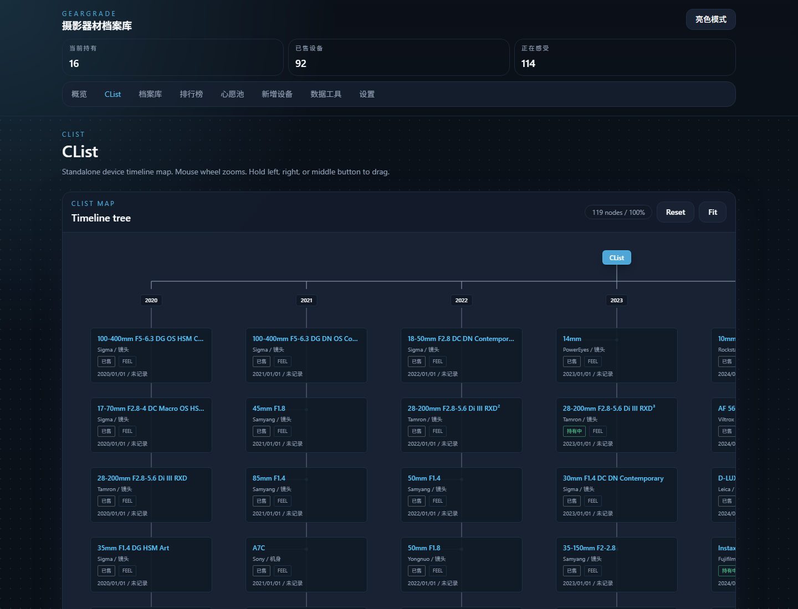

# Geargrade

Geargrade 是一个面向个人摄影器材管理的自托管 Web 应用。它的重点不是通用库存，而是“设备档案 + 持有状态 + 主观评价 + 买卖记录 + 浏览筛选 + 榜单分析”。

当前版本已经支持主设备库、独立心愿池、数据导入导出、全量重置、本地与远程图片录入，以及围绕评分、持有时长和理财结果的可视化展示。

## 累计更新（v0.7）

本次 v0.7 重点补齐 CList 脑图视图与交互细节，变化如下：

- 新增独立 `/clist` 页面，入口位于顶部导航“概览”旁边
- CList 以购入年份构建设备时间树，使用坐标化节点与 SVG 连线提升层级对齐精度
- CList 画板背景跟随深色 / 亮色主题 token，不再使用固定色
- CList 画板支持滚轮缩放，并在画板内阻止页面跟随滚轮上下滚动
- CList 画板支持左键、右键、中键按住拖拽平移
- 新增 `Fit` 视图按钮，自动缩放到尽量看全整张 CList 脑图

## 累计更新（v0.5）

本次 v0.5 主要是对数据导入导出工作流、应用偏好设置和发布产物管理方式做扩展，重点变化如下：

- 新增 GGPack 导入导出链路，支持主设备库、心愿池、整包预览校验与按行导入
- 数据工具改为独立 `/data-tools` 页面，导入、导出、预览和重置操作集中管理
- 新增应用设置页与全局设置状态，支持简化模式等前端展示偏好
- 排行榜持有时长支持按天或按月展示，简化模式下自动切换更适合阅读的时间粒度
- 设备卡片、图标、详情与表单交互继续收口，补齐相应前后端测试
- `dist/` 目录改为本地构建产物目录，不再纳入 Git 仓库同步；离线包统一从 GitHub Releases 获取

## 技术栈

- 前端：React + TypeScript + Vite + Tailwind CSS
- 后端：FastAPI + SQLAlchemy
- 数据库：SQLite
- 部署：Docker Compose
- 运行形态：单容器 `app`，内含后端 API 与前端静态资源

## 当前能力

- 主设备库 CRUD
- 独立心愿池 CRUD
- 深色 / 亮色主题切换
- 顶栏全局统计：当前持有、已售设备、正在感受
- Dashboard 可视化概览
- 独立 CList 脑图视图
- 评价等级分布
- 设备类别分布
- 年度购买量统计与分布叠加
- 当前持有设备快捷面板
- 卡片视图 / 表格视图切换
- 表格表头排序
- 关键词、类别、状态、评价、感受状态、购入年份筛选
- 设备详情右侧抽屉
- 数字评分映射评价体系
- `score = -1` 表示“正在感受”
- 第几次购入的角标展示
- 排行榜：评分榜、持有时间榜、理财榜
- 结构化 JSON 导入 / 导出
- 数据模板下载
- 五步确认的“重置所有数据”
- 本地图片上传
- 本地图片粘贴上传
- 远程图片 URL 下载缓存
- 示例数据自动初始化

## 页面截图

以下截图通过本地无头浏览器静默生成，文件位于 `docs/screenshots/`。

### 首页总览

首页展示顶栏统计、评分与类别图表、年度购买量、筛选区和主设备库列表。


### CList 脑图

CList 页面位于独立 `/clist` 路由，按购入年份组织设备时间树。画板支持滚轮缩放、三键拖拽平移和一键 Fit 看全图。



### 设备详情抽屉

详情抽屉用于在不离开列表页的前提下查看完整设备档案，包括数字评分主视觉、优缺点、价格、持有时长与每日成本。


### 排行榜

排行榜页支持评分榜、持有时间榜和理财榜切换，顶部突出展示 Top 3，下面承接完整列表。


### 数据工具

数据工具位于独立 `/data-tools` 页面，用于通过 GGPack 表格包导入导出主设备库与心愿池，以及执行高危数据重置。


### 新增设备

新增设备页支持录入品牌、类别、卡口系统、数字评分、购入次序、详细评价、价格与图片来源。


## 快速开始

1. 复制环境变量文件

```powershell
Copy-Item .env.example .env
```

2. 启动服务

```bash
docker compose up -d --build
```

3. 打开应用

```text
http://localhost:8080
```

## Docker Compose 模板

下面这个模板适合放在独立部署目录中，例如：

```text
deploy/
├─ docker-compose.yml
└─ .env
```

如果你使用 GitHub Releases 里的离线镜像包，先下载对应文件到本地，再导入镜像。

说明：

- `dist/` 目录仅用于本地打包与临时存放产物，不再提交到仓库
- 离线镜像包请从 Releases 页面获取，而不是从仓库文件树获取

然后导入镜像：

```bash
docker load -i geargrade-v0.4-linux-amd64.tar
```

ARM 设备改为：

```bash
docker load -i geargrade-v0.4-linux-arm64.tar
```

然后使用以下 Compose 模板：

```yaml
services:
  geargrade:
    image: geargrade:v0.4-amd64
    container_name: geargrade-app
    restart: unless-stopped
    ports:
      - "8080:8000"
    env_file:
      - .env
    volumes:
      - geargrade_data:/app/data
      - geargrade_media:/app/data/media

volumes:
  geargrade_data:
  geargrade_media:
```

ARM 镜像标签改为 `geargrade:v0.4-arm64`。

## 环境变量

`.env.example` 提供了默认配置：

- `APP_ENV`：运行环境标记
- `DATABASE_URL`：SQLite 数据库路径
- `MEDIA_ROOT`：图片缓存根目录
- `MEDIA_URL_PREFIX`：媒体公开路径前缀
- `SEED_SAMPLE_DATA`：首次启动且数据库为空时自动注入示例数据

## 数据与持久化

当前 Docker Compose 使用单个应用容器和两个命名卷：

- `geargrade-app`：唯一运行容器，同时提供 FastAPI API 与前端静态资源
- `geargrade_data`：SQLite 数据文件
- `geargrade_media`：上传图片和远程缓存图片

## 核心规则

### 评分规则

- `score = -1`：正在感受，不参与评分分布和评分榜
- `score = 0-49`：低
- `score = 50-79`：中规中矩
- `score = 80-100`：极佳
- `score > 100`：神

### 状态归一化

- `holding`：自动清空 `sale_price` 和 `sale_date`
- `for_sale`：自动清空 `sale_price` 和 `sale_date`
- `broken`：`sale_price` 自动记为 `0`，`sale_date` 为空
- `sold`：允许填写 `sale_price` 和 `sale_date`

### 每日成本规则

每日成本只在以下两种情况下计算：

- 持有中：`purchase_price / 持有天数`
- 已售出：`(purchase_price - sale_price) / 持有天数`

补充规则：

- 持有天数起点固定为 `purchase_date`
- 持有中终点取当前日期
- 已售出终点取 `sale_date`
- 天数最小按 `1` 天处理
- `for_sale` 和 `broken` 不计算每日成本

## 主设备库与心愿池

心愿池采用与主设备库“同结构、独立数据表”的方案。

这意味着：

- 心愿池不会进入首页 Dashboard 统计
- 心愿池不会进入主设备库列表与详情路由
- 心愿池不会进入评分榜、持有时间榜或理财榜
- 心愿池不会被旧版主设备库 JSON 导入导出接口处理

当前导航结构：

- `/`：主设备库 Dashboard
- `/leaderboards`：排行榜
- `/wishlist`：心愿池
- `/devices/new`：新增主设备
- `/data-tools`：GGPack 导入导出与数据重置

## API 概览

### 主设备库

- `GET /api/v1/health`
- `GET /api/v1/dashboard/summary`
- `GET /api/v1/devices`
- `GET /api/v1/devices/{id}`
- `POST /api/v1/devices`
- `PATCH /api/v1/devices/{id}`
- `DELETE /api/v1/devices/{id}`

### 排行榜

- `GET /api/v1/leaderboards/holding-duration`
- `GET /api/v1/leaderboards/score`
- `GET /api/v1/leaderboards/finance`

### 心愿池

- `GET /api/v1/wishlist/devices`
- `GET /api/v1/wishlist/devices/{id}`
- `POST /api/v1/wishlist/devices`
- `PATCH /api/v1/wishlist/devices/{id}`
- `DELETE /api/v1/wishlist/devices/{id}`

### 数据工具

- `GET /api/v1/data/export`
- `POST /api/v1/data/import`
- `GET /api/v1/data/ggpack/export?scope=devices|wishlist|all`
- `POST /api/v1/data/ggpack/preview`
- `POST /api/v1/data/ggpack/import`
- `POST /api/v1/data/reset`

### 媒体

- `POST /api/v1/media/upload`
- `POST /api/v1/media/cache-remote`

### 引导

- `POST /api/v1/bootstrap/sample-data`

## 导入导出

新版导入导出使用 Geargrade 自有 GGPack JSON 格式，扩展名建议为 `.ggpack.json`。包内按表组织，支持 `devices` 主设备库和 `wishlist` 心愿池。

导入行为：

- 格式：`geargrade.ggpack.v1`
- 策略：先预览校验，再按选中行导入
- 去重键：`brand + name + acquisition_iteration + purchase_date`
- 心愿池去重键：`brand + name + acquisition_iteration`
- 重复项：更新覆盖

模板文件：

- `templates/device-import.template.json`
- `templates/device-import.example.json`

旧版 `/api/v1/data/export` 与 `/api/v1/data/import` 仍保留，只处理主设备库 JSON。GGPack 导出结果可以直接再导入，也适合“导出 -> 让 AI 整理或补全 -> 再导回”的工作流。

## 数据重置

“重置所有数据”入口位于 `/data-tools` 页面。

执行规则：

- 前端需要连续确认 5 次
- 任意取消或关闭都会将确认进度清零
- 后端会一次性清空：
  - 主设备库
  - 心愿池
  - 本地媒体文件

接口返回结果包括：

- `devices_deleted`
- `wishlist_deleted`
- `media_files_deleted`

## 本地开发

### 后端

```bash
cd backend
python -m venv .venv
.venv\Scripts\activate
pip install -r requirements.txt
uvicorn app.main:app --reload
```

### 前端

```bash
cd frontend
npm install
npm run dev
```

## 测试

后端：

```bash
cd backend
pytest
```

前端：

```bash
cd frontend
npm test
```

## 后续扩展方向

- 时间线视图
- 价格波动记录
- 多图管理
- 更完整的数据备份与恢复
